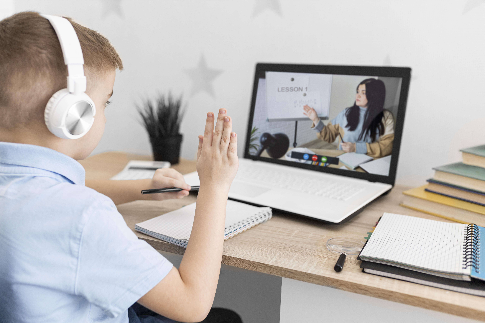
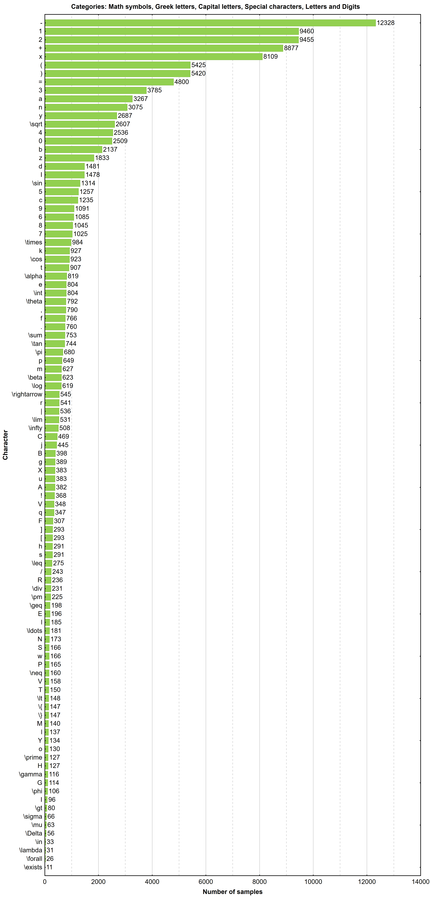
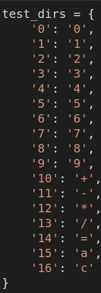
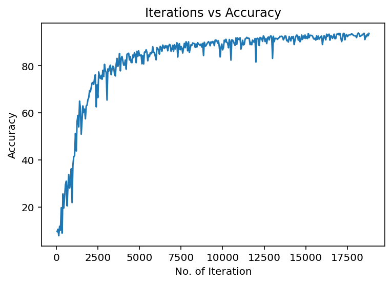
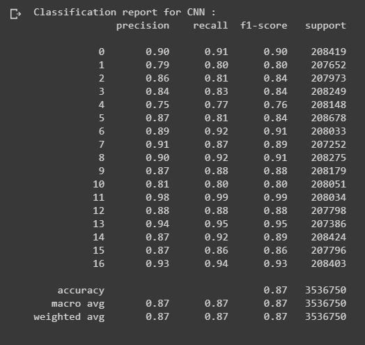

# Computer Vision Project: Virtual Whiteboard for online class

- Adrian Flores Camacho
- Andrés Saúl Bellido Gonzales
- Alejandro Núñez Arroyo
- Raul Angel Mollocuaquira Caparicona

# Introduction

---

Virtual classes and videoconferencing have become a daily topic in recent months,  largely due to the emergence of the global pandemic that forced us to have a new methodology for the study.

The virtual classes were of great help, but there are some aspects that hindered the explanations in class,  for example, the tracing of numerical characters and letters,  teachers and exhibitors use the mouse to point or write on the screen, they do not have an electronic device such as a tablet with which they can write these characters, also the handwriting of each person is different, these characteristics complicate the proper understanding of what is to be transmitted.  The algorithm shown in this paper provides a solution to these problems.

So the present work consists of the implementation of a hand recognition algorithm to trace letters and numbers in a space visible to a computer camera in order to obtain a "virtual whiteboard" and achieve a more intuitive explanation by a teacher or speaker in a video conference who needs to use a whiteboard while explaining the content of the ideas to be shared.

## Libraries we use

## Dataset

We looked for a different data set to the MNIST, which was the basis for presenting the results in Project milestone, and we looked for the new data set to allow us not only to have the information of numbers between 0 and 9 but also to contain different numeric characters and letters . . For this we will use the implementation of the handwritten mathematical symbol data set, which has different character classes provided by [CROHME extractor](https://github.com/ThomasLech/CROHME_extractor). 

## Hand detection and segmentation

Mediapipe was very useful to us to add value to our project,mediapipe has functions for face recognition, face meshing,object detection, face and hair segmentation, etc. The functionthat interested us for the project was the detection of hands,which allowed us to detect a hand next to the characteristicpoints, a function included in mediapipe is to obtain thecoordinates of these points that helped us to verify if a fingeris raised and if it is not, and this was very useful to performdrawing functions in the interface.

## Virtual Whiteboard interface

There is the selection mode when only the index finger is extended, in this mode, you can select between 4 colors, with RGB values of (255,0,0), (0,255,0), (0,0,255), and (0,0,0), in the drawing mode that is entered with the index and middle fingers extended, with the colors and the ”cv2.line ()”function you can draw lines on the created canvas and on the same image obtained by the frames in the coordinates of the tip of the index finger. The last drawing function you have is to clean all the drawings that can be activated if only the pinkie finger is extended.

## Character recognition

These images are read and recognized by a trained model, whichdefines the class to which the trace belongs, outputting thepredicted character.Finally, this value predicted by the model is taken as theindex of the dictionary previously generated with the classes,and finally, all these values are concatenated to be able tobe put on another canvas but as text, the result is the following:

## Results of Neural Network

Below you can see some predictions that the model makes regarding the classes of numbers that it has

For the training of the characteristic classes, an increase was made in the classes ranging from 0 to 16, the following dictionary shows the prediction values ​​with their respective keys.

The  following  figure  shows  the  Iterations  vs  Precisionwhich shows us how the accuracy increases when doing moreiterations  during  the  training,  managing  to  observe  that  theprecision little by little increases its accuracy to 100

Finally, we  observe  that  the  support  metric  shows  us  the  number  ofimages  that  are  true  responses  for  each  model,  showing  thateach class has more than 207,000 true images for each class.

To know more about the training process you can review the colab notebook below:
https://colab.research.google.com/drive/1N0YxZ4emkIuhMeOZQf8Cih59i8RLi_KM?authuser=2

## Conclusions
In conclusion the main objectives, which are, hand gesturerecognition  and  written  text  recognition,  were  accomplished.The  challenges  that  existed  in  the  development  of  the  al-gorithm  was  to  train  and  improve  the  accuracy  of  the  textrecognition.  Also,  it  was  challenging  to  design  the  way  ofinteraction between the user and the computer because somegestures like extending all fingers could cause that the wholedrawing  will  be  erased. 

## REFERENCES
[1]  .    Anofryev    (2021,    May).    Offline    Handwritten    Text    Recogni-tion [Online]. Available:https://www.kaggle.com/alexeyanofryev/offline-handwritten-text-ocr/execution

[2]  .  Z.  Ren,  J.  Meng,  J.  Yuan,  and  Z.  Zhang,  (2011)  Position-Free  HandGesture Recognition Using Single ShotMultiBox Detector Based NeuralNetwork [Online]. Available: https://doi.org/10.1145/2072298.2072443.

[3]  . (2021, Apr). THE MNIST DATABASE of handwritten digits [Online].Available: http://yann.lecun.com/exdb/mnist/

[4]  .(2021,Apr).Handwrittenmathsymbols(CROHMEdatasetdataset)[Online].Available:https://www.kaggle.com/xainano/handwrittenmathsymbols

[5]  .  OpenCV  team  (2021,  Apr).  Open  Source  Computer  Vision  Library[Online]. Available: https://opencv.org/about/

[6]  .   Grishchenko   I.,   Bazarevsky   V.   (2020,   Dec).   MediaPipe   Holistic—  Simultaneous  Face,  Hand  and  Pose  Prediction,  on  Device  [On-line].  Available:  https://ai.googleblog.com/2020/12/mediapipe-holistic-simultaneous-face.html

[7]  Torch    Contributors    (2021)    TORCHVISION    [Online].    Available:https://pytorch.org/vision/stable/index.html

[8]  .    (2021,    Apr).    handwritten-digit-recognition    [Online].    Available:https://github.com/amitrajitbose/handwritten-digit-recognition

[9]  (2021, Apr). [Online] Available: https://colab.research.google.com/drive/1E8skjsRJRUfZHzPTQKVpG3UAiUgWNt7

[10]  (2021, Apr). [Online] Available: https://pytorch.org/docs/stable/generated/torch.nn.LogSoftmax.htmltorch.nn.LogSoftmax
